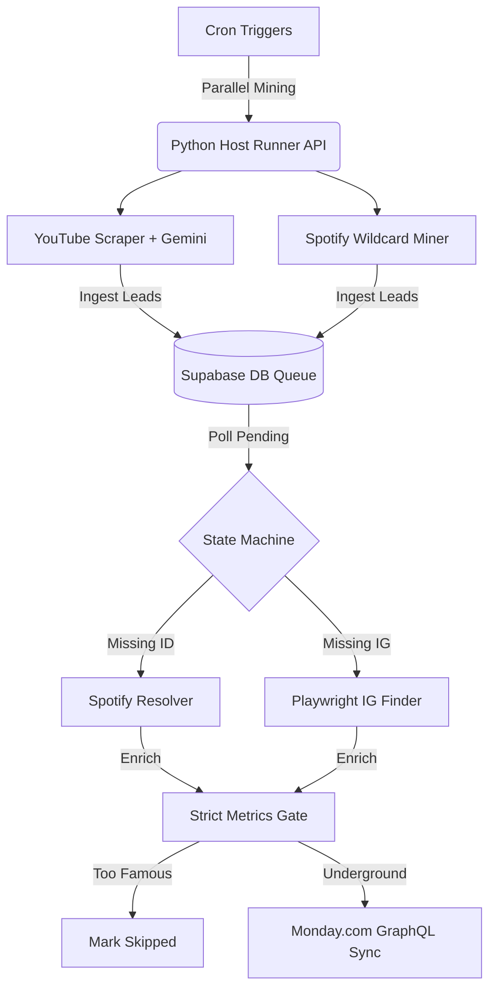

# 🏆 BeatMatch AI Automation Hub

> **[ 🇧🇷 Ler em Português ](README.pt-br.md)**

An enterprise-grade, autonomous data engineering and AI orchestration pipeline designed to discover, verify, clean, and enrich rising independent music talent. 

This project demonstrates advanced **AI Automation**, integrating custom Python microservices, Playwright crawlers, LLM classification (Gemini), and CRM dispatching (Monday.com), all orchestrated asynchronously by **n8n** running on a Google Cloud VPS.

---

## 🌟 Key Features & Upgrades

### 1. Free Local Scrapers (Bypassing Apify Costs)
To optimize operational costs, the pipeline uses native API integrations and headless local crawlers:
* **YouTube Comments Miner**: Leverages the official Google YouTube Data API v3 to scrape "Type Beat" comment sections.
* **Playwright Instagram Crawler**: Uses a dual-engine fallback (Yahoo Search -> Bing Base64 Redirect Decoder) via Playwright Chromium to accurately resolve Instagram profiles without triggering CAPTCHAs or requiring paid proxies.

### 2. Gemini 2.5 Flash AI Talent Classifier
Filters out noise using Google's Gemini LLM. Instead of relying on rigid keyword regex, Gemini semantically evaluates YouTube comments to distinguish true emerging artists (rappers, vocalists) from beatmakers, feedback listeners, or spam bots.

### 3. Strict Metrics Verification (Gatekeeping)
The pipeline intercepts Spotify GraphQL payloads and queries YouTube statistics to enforce strict "underground" thresholds:
* Artists with `> 8,000` Spotify Monthly Listeners are automatically skipped.
* Artists with any track exceeding `10,000` plays/views are skipped (`skipped_too_famous`).

### 4. Cloud Native Architecture
* **Google Cloud VPS (e2-medium)**: Hosts the entire ecosystem.
* **Containerized n8n**: Orchestrator runs in Docker Compose mapped to local storage.
* **Host Script Runner**: A secure Python Flask API managed by `systemd` that allows n8n to execute asynchronous Python tasks natively on the host OS, preventing container bloat and memory leaks.
* **Supabase PostgreSQL**: Serverless database running via an IPv4 connection pooler to manage the master queue state machine.

---

## 🏗️ System Architecture



---

## 📂 Repository Structure

```text
beatmatch_ai_automation_hub/
├── docker-compose.yml                  # n8n container deployment
├── beatmatch-runner.service            # Systemd service for Host API
├── n8n/
│   └── workflow_unified_beatmatch_http.json  # Exported n8n visual workflow
├── src/
│   ├── host_runner.py                  # Flask API for n8n-to-host execution
│   ├── reconciler.py                   # Master queue state machine
│   ├── scrapers/
│   │   ├── youtube_scraper.py          # YT API + Gemini Classifier
│   │   ├── apify_twitter.py            # Legacy Twitter scraper
│   │   └── spotify_miner.py            # Regional Wildcard Spotify Search
│   ├── enrichers/
│   │   ├── spotify_resolver.py         # Resolves names to Spotify IDs
│   │   └── instagram_finder.py         # Playwright dual-engine searcher
│   ├── quality/
│   │   └── sipa_cleaner.py             # Deduplication & cleaner
│   └── utils/
│       ├── db.py                       # Supabase DB connection layer
│       └── export_to_monday.py         # Monday.com API sync
└── README.md
```

---

## 🚀 How to Run & Deploy

1. **Environment Setup**:
   Clone the repository and install the Python dependencies.
   ```bash
   git clone https://github.com/jraphaelbarbosa/beatmatch-ai-automation-hub.git
   cd beatmatch-ai-automation-hub
   python -m venv venv
   source venv/bin/activate
   pip install -r requirements.txt
   playwright install chromium
   ```

2. **Configure `.env`**:
   Populate your API keys for Spotify, Gemini, YouTube, Supabase, and Monday.com.

3. **Start the Host Runner**:
   The Host Runner API listens on port 5000 and securely executes the Python microservices for n8n.
   ```bash
   python src/host_runner.py
   ```

4. **Launch n8n Orchestrator**:
   Start the Dockerized n8n instance and import the workflow from `n8n/workflow_unified_beatmatch_http.json`.
   ```bash
   docker compose up -d
   ```

5. **Trigger the Pipeline**:
   Activate the workflow in n8n. The system will automatically run on its schedule, mine artists, classify them with AI, enforce metrics, and sync qualified leads to your Monday.com board.
