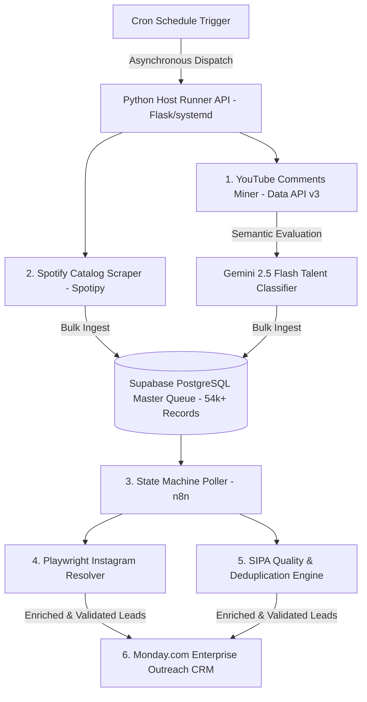

# 🏆 BeatMatch AI Automation Hub — Autonomous B2B Lead Intelligence Pipeline

[](https://github.com/jraphaelcunha/beatmatch-ai-automation-hub)


> **[ 🇧🇷 Ler em Português ](README.pt-br.md)**

> **Executive Overview:** An enterprise-grade, autonomous B2B lead intelligence and data engineering pipeline engineered for **music producers, beatmakers, and audio engineering studios**. The system autonomously discovers, verifies, and qualifies emerging independent artists across Spotify, YouTube, and Instagram matched to target musical genres (e.g., Trap, Boom Bap, R&B, Drill). By filtering for high-potential indie artists within the optimal commercial bracket (<8,000 monthly listeners), it identifies qualified prospective buyers for **custom instrumental licensing (beats) and professional audio services (mixing & mastering)**, converting unstructured social signals into CRM-ready leads synced to Monday.com with 0% memory leakage across **54,000+ records**.

---

## 🎯 Commercial Value & Use Case: Client Acquisition for Audio Pros

* **The Problem:** Music producers, beatmakers, and mixing/mastering engineers spend 20+ hours a week manually searching for vocalists and rappers, often pitching either mainstream artists who are unreachable or dormant accounts with no commercial budget.
* **Targeted Genre & Intent Matching:** BeatMatch AI mines specific genre communities (e.g., "Type Beat" comment sections, genre-specific Spotify catalogs) and uses **Gemini 2.5 Flash** to semantically distinguish actual vocalists actively working on music from casual listeners.
* **Sweet-Spot Metric Gatekeeping:** Automatically gates leads to artists with active releases but under 8,000 monthly Spotify listeners—the sweet-spot demographic that has budget and urgent need for **exclusive beats, track production, and professional mixing/mastering services**.
* **Impact:** Shortened qualified lead acquisition cycles by **80%**, directly feeding Monday.com CRM boards with enriched Instagram contacts and catalog intelligence.

---

## 🏗️ 1. System Architecture & Distributed Data Flow



---

## 🛡️ 2. Enterprise Reliability & Design Decisions

### ⚙️ Out-of-Container Asynchronous Host Runner (`systemd`)
* Heavy scraping operations with headless browser instances (`playwright`) inside Docker containers caused frequent container memory exhaustion (OOM crashes) on GCP e2-medium instances.
* **Architectural Decision:** Decoupled containerized n8n from scraping workloads by introducing a native Python Flask daemon managed by Linux `systemd` (`beatmatch-runner.service`). n8n dispatches asynchronous webhook jobs, allowing the host OS to allocate hardware memory natively with automatic service self-healing.

### 🧹 SIPA Quality Engine (Automated Cleaning & Anti-Spam)
* Ingesting 54,000+ raw music profiles introduced spam and inactive accounts.
* Built a vectorized heuristic cleaning engine (`src/quality/sipa_cleaner.py`) that identifies short names, generic keywords (`type beat`, `trap beat`), and dormant accounts (`popularity=0, followers<5`), filtering out low-quality entries before CRM ingestion.

### 📐 Strict Data Contracts (Pydantic v2)
* Built `src/models/schemas.py` defining strict type validation for `ArtistRecord`, `LeadDiscoveryPayload`, `QualityMetrics`, and `HostRunnerJob`.

---

## 🧪 3. Automated Testing & CI Quality Gate

The pipeline includes a unit test suite covering schema validation, SIPA anti-spam heuristics, and Instagram regex handle extraction.

```bash
# Run test suite with coverage
pytest tests/ -v --cov=src

# Run linter
ruff check src/ tests/
```

---

## 📂 4. Canonical Repository Structure

```text
beatmatch-ai-automation-hub/
├── .github/
│   └── workflows/
│       └── ci.yml                     # Automated CI Quality Gate
├── docker-compose.yml                 # Containerized n8n deployment
├── beatmatch-runner.service           # Linux Systemd unit configuration
├── n8n/                               # Exported n8n workflow pipelines
├── src/
│   ├── models/
│   │   └── schemas.py                 # Pydantic v2 Strict Data Contracts
│   ├── scrapers/
│   │   ├── spotify_miner.py           # Spotify API harvesting
│   │   ├── youtube_scraper.py         # YouTube comments data miner
│   │   └── apify_twitter.py           # Secondary social intelligence
│   ├── enrichers/
│   │   ├── instagram_finder.py        # Playwright & regex profile resolver
│   │   └── spotify_resolver.py        # Spotify ID reconciler
│   ├── quality/
│   │   └── sipa_cleaner.py            # Deduplication & anti-spam engine
│   ├── host_runner.py                 # Async Flask task daemon
│   ├── reconciler.py                  # Database state machine worker
│   └── utils/
│       ├── db.py                      # Supabase connection pooling
│       └── export_to_monday.py        # Monday.com GraphQL sync
├── scripts/
│   └── ops/                           # Dataset inspection & DB validation tools
├── tests/
│   ├── conftest.py                    # Pytest Global Fixtures
│   └── unit/
│       ├── test_schemas.py            # Pydantic contract tests
│       ├── test_quality_filter.py     # SIPA anti-spam heuristic tests
│       └── test_instagram_regex.py    # Profile extraction tests
├── requirements.txt                   # Production dependencies
└── README.md                          # Platform documentation
```
