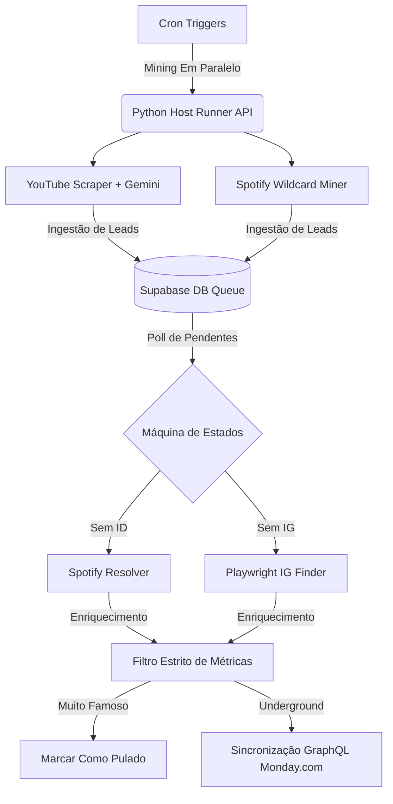

# 🏆 BeatMatch AI Automation Hub

> **[ 🇺🇸 Read in English ](README.md)**

Um pipeline de engenharia de dados autônomo e orquestração de IA de nível enterprise projetado para descobrir, verificar, limpar e enriquecer talentos musicais independentes em ascensão.

Este projeto demonstra automação avançada com IA (**AI Automation**), integrando microserviços Python customizados, crawlers com Playwright, classificação semântica via LLM (Gemini) e envio para CRM (Monday.com), tudo orquestrado de forma assíncrona pelo **n8n** rodando em uma VPS no Google Cloud.

---

## 🌟 Principais Recursos & Upgrades

### 1. Scrapers Locais Gratuitos (Bypassing de Custos do Apify)
Para otimizar custos operacionais, o pipeline utiliza integrações nativas de API e crawlers locais headless:
* **YouTube Comments Miner**: Utiliza a API oficial do Google YouTube Data v3 para extrair seções de comentários em vídeos de "Type Beat".
* **Playwright Instagram Crawler**: Implementa mecanismo de busca dupla (Yahoo Search -> Decodificador de Redirecionamento Bing Base64) via Playwright Chromium para encontrar perfis no Instagram sem disparar CAPTCHAs ou exigir proxies pagos.

### 2. Classificador de Talentos Gemini 2.5 Flash AI
Filtra ruídos utilizando o modelo Gemini da Google. Em vez de utilizar regex rígido por palavras-chave, o Gemini avalia semanticamente os comentários do YouTube para distinguir artistas emergentes reais (rappers, vocalistas) de beatmakers, ouvintes casuais ou bots de spam.

### 3. Verificação Estrita de Métricas (Gatekeeping)
O pipeline intercepta payloads do GraphQL do Spotify e faz consultas de estatísticas no YouTube para aplicar limites rígidos de artistas "underground":
* Artistas com `> 8.000` ouvintes mensais no Spotify são ignorados automaticamente.
* Artistas com qualquer faixa que supere `10.000` reproduções/visualizações são ignorados (`skipped_too_famous`).

### 4. Arquitetura Cloud Native
* **Google Cloud VPS (e2-medium)**: Hospeda todo o ecossistema.
* **n8n Containerizado**: Orquestrador rodando via Docker Compose mapeado para armazenamento local.
* **Host Script Runner**: Uma API segura em Python Flask gerenciada por `systemd` que permite ao n8n executar tarefas assíncronas em Python nativamente no SO hospedeiro, evitando inchaço do container e vazamentos de memória.
* **Supabase PostgreSQL**: Banco de dados serverless rodando via pooler de conexões IPv4 para gerenciar a máquina de estados da fila principal.

---

## 🏗️ Arquitetura do Sistema



---

## 📂 Estrutura do Repositório

```text
beatmatch_ai_automation_hub/
├── docker-compose.yml                  # Implantação dos containers n8n
├── beatmatch-runner.service            # Serviço Systemd para a API Host
├── n8n/
│   └── workflow_unified_beatmatch_http.json  # Workflow visual exportado do n8n
├── src/
│   ├── host_runner.py                  # API Flask para execução n8n-para-host
│   ├── reconciler.py                   # Máquina de estados da fila principal
│   ├── scrapers/
│   │   ├── youtube_scraper.py          # API YT + Classificador Gemini
│   │   ├── apify_twitter.py            # Scraper legado de Twitter
│   │   └── spotify_miner.py            # Busca coringa regional do Spotify
│   ├── enrichers/
│   │   ├── spotify_resolver.py         # Resolve nomes para IDs do Spotify
│   │   └── instagram_finder.py         # Buscador duplo com Playwright
│   ├── quality/
│   │   └── sipa_cleaner.py             # Limpeza e desduplicação
│   └── utils/
│       ├── db.py                       # Camada de conexão com Supabase DB
│       └── export_to_monday.py         # Sincronização API Monday.com
└── README.md
```

---

## 🚀 Como Executar e Implantar

1. **Configuração do Ambiente**:
   Clone o repositório e instale as dependências Python.
   ```bash
   git clone https://github.com/jraphaelbarbosa/beatmatch-ai-automation-hub.git
   cd beatmatch-ai-automation-hub
   python -m venv venv
   source venv/bin/activate
   pip install -r requirements.txt
   playwright install chromium
   ```

2. **Configurar o `.env`**:
   Preencha suas chaves de API para Spotify, Gemini, YouTube, Supabase e Monday.com.

3. **Iniciar o Host Runner**:
   A API Host Runner escuta na porta 5000 e executa com segurança os microserviços Python para o n8n.
   ```bash
   python src/host_runner.py
   ```

4. **Iniciar o Orquestrador n8n**:
   Inicie a instância containerizada do n8n e importe o workflow de `n8n/workflow_unified_beatmatch_http.json`.
   ```bash
   docker compose up -d
   ```

5. **Disparar o Pipeline**:
   Ative o workflow no n8n. O sistema executará automaticamente conforme o cronograma, minerando artistas, classificando-os com IA, aplicando filtros de métricas e sincronizando leads qualificados para o seu quadro no Monday.com.
